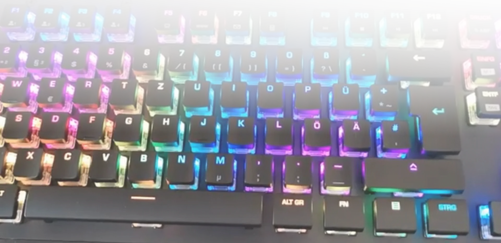

    
  &nbsp;&nbsp;
  &nbsp;&nbsp;
  &nbsp;&nbsp;
  
    

## Eruption - Realtime RGB LED Software for Linux

A Linux user-mode input and RGB LED driver for keyboards, mice and other devices

For a list of recent news and noteworthy changes, please refer to [CHANGES.md](https://github.com/eruption-project/eruption/blob/master/CHANGES.md)

### Image and Video Gallery

## Device Compatibility

### Keyboards

- [x] ROCCAT Vulcan 100/12x series keyboard (fully supported, stable)
- [x] ROCCAT Vulcan Pro TKL series keyboard (98% supported as of version `0.1.19`, testing)
- [ ] ROCCAT Vulcan TKL series keyboard (work-in-progress, as of version `0.1.20`, experimental, untested)
- [ ] ROCCAT Vulcan Pro series keyboard (work-in-progress, as of version `0.1.20`, experimental, untested)
- [ ] ROCCAT Magma series keyboard (work-in-progress, as of version `0.1.23`, experimental)
- [ ] ROCCAT Pyro series keyboard (work-in-progress, as of version `0.5.0`, experimental)
- [ ] Corsair Strafe Gaming Keyboard (non-RGB/monochrome only, as of version `0.1.20`, experimental)

### Mice

- [x] ROCCAT Kone Pure Ultra (stable)
- [x] ROCCAT Burst Pro (as of version `0.1.20`, testing)
- [ ] ROCCAT Kain 100 AIMO (as of version `0.2.0`, experimental)
- [x] ROCCAT Kain 2xx AIMO (as of version `0.1.23`, testing)
- [ ] ROCCAT Kone XP (work-in-progress, as of version `0.2.0`, experimental)
- [ ] ROCCAT Kone Pro (work-in-progress, as of version `0.2.0`, experimental)
- [x] ROCCAT Kone Pro Air (work-in-progress, as of version `0.2.0`, testing)
- [ ] ROCCAT Kone Aimo (experimental)
- [ ] ROCCAT Kone Aimo Remastered (experimental)
- [ ] ROCCAT Kova AIMO (testing)
- [ ] ROCCAT Kova 2016 (as of version `0.1.23`, testing)
- [ ] ROCCAT Kone XTD (as of version `0.1.20`, experimental)

### Miscellaneous Devices

- [x] ROCCAT/Turtle Beach Elo 7.1 Air Wireless Headset (work-in-progress, as of version `0.1.23`, testing)
- [x] ROCCAT Sense AIMO XXL (as of version `0.1.23`, stable)
- [x] Adalight/Custom serial LEDs (testing)

Please see [DEVICES.md](https://github.com/eruption-project/eruption/blob/master/DEVICES.md) for further information
